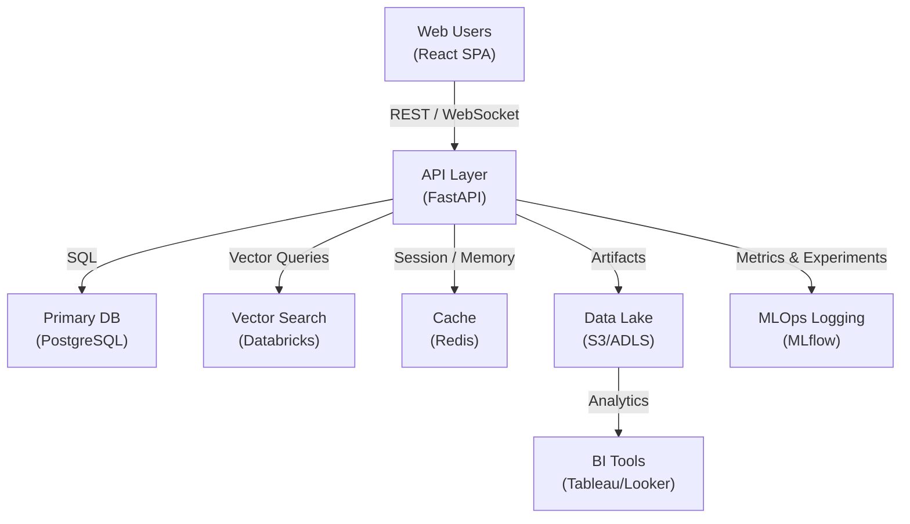
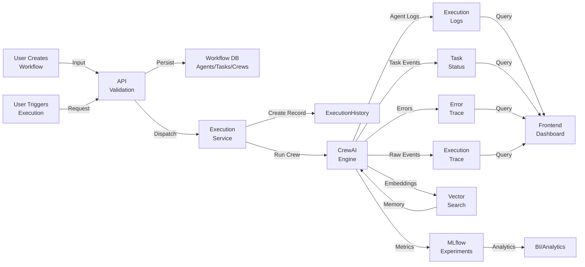
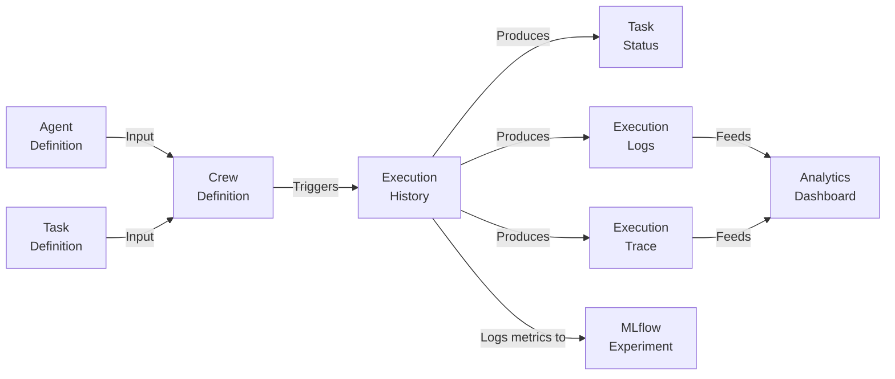

# Data Architecture Document Template

A comprehensive template for documenting data architecture across systems. Customize sections based on your project's needs.

---

## 1. Executive Summary

**Purpose**: High-level overview for stakeholders, architects, and technical leads.

- **What this document covers**: Data flow, storage strategy, scalability approach, compliance
- **Scope**: Which systems, databases, and data flows are included
- **Key objectives**: Performance targets, data consistency requirements, disaster recovery goals
- **Audience**: Who should read this (architects, engineers, DBAs, compliance officers)

**Example**:
> This document describes the data architecture for the Kasal AI orchestration platform. It covers the flow of AI workflow definitions, execution data, and observability logs across a multi-tenant PostgreSQL backend and vector search indices. The architecture prioritizes tenant isolation, horizontal scalability, and sub-second query latency for execution history lookups.

---

## 2. Data Architecture Overview

**Purpose**: Visual and textual overview of the complete data landscape.

### 2.1 System Context Diagram

Show how this system fits within the broader data ecosystem.



### 2.2 Data Domains

Organize data into logical domains (typically aligned with business domains):

| Domain | Primary Entity | Storage | Purpose |
|--------|---|---------|---------|
| **Identity** | User, Group | PostgreSQL | Authentication, authorization, user profiles |
| **Workflow Definition** | Agent, Task, Crew | PostgreSQL | AI workflow templates and configurations |
| **Execution** | ExecutionHistory, Logs, Traces | PostgreSQL + TimescaleDB | Job runs, monitoring, debugging |
| **Memory & Knowledge** | Embeddings, Vectors | Vector Search | Semantic search, agent memory, knowledge retrieval |
| **Observability** | Metrics, Traces, Logs | S3 + MLflow | Experiment tracking, debugging, analytics |
| **Configuration** | Models, Tools, Schedules | PostgreSQL | System settings, tool registry, job schedules |

---

## 3. Data Flow Architecture

**Purpose**: Show how data moves through the system.

### 3.1 End-to-End Data Flow



### 3.2 Write Paths

Describe how data gets written (ingestion, updates):

| Path | Trigger | Volume | Latency SLA | Idempotent |
|------|---------|--------|------------|-----------|
| **Workflow Definition** | User saves agent/task/crew | Low | <500ms | Yes (upsert) |
| **Execution Lifecycle Update** | Crew starts/completes/fails | High | <100ms | Yes (status machine) |
| **Execution Logs** | Agent emits event | Very high | <1s | No (append-only) |
| **Execution Traces** | Tool call/thought/output | Very high | <1s | No (append-only) |
| **Vector Embeddings** | Agent reads/writes memory | High | <500ms | Yes (upsert) |

### 3.3 Read Paths

Describe how data gets read (queries, reports):

| Path | Consumer | Latency SLA | Consistency |
|------|---------|------------|-------------|
| **Execution History** | Frontend, API | <500ms | Strong (transactional) |
| **Execution Logs** | Frontend polling, logs endpoint | <2s | Eventually consistent |
| **Vector Search** | CrewAI agents during execution | <300ms | Strong |
| **Model Configs** | Agent initialization | <1s | Cached |
| **Metrics/Analytics** | BI tools, dashboards | <5min | Eventually consistent |

---

## 4. Data Lifecycle Management

**Purpose**: Describe how data is created, used, archived, and deleted.

### 4.1 Data Lifecycle Stages

```
Raw Data
  ├─ Ingestion: Data enters the system
  ├─ Processing: Data is validated, normalized, enriched
  ├─ Storage: Data is persisted (transactional or analytical)
  ├─ Access: Data is queried and used by applications
  ├─ Archival: Old data is moved to cold storage
  └─ Deletion: Data is purged per retention policy
```

### 4.2 Retention Policies

| Data Type | Retention Period | Action | Rationale |
|-----------|-----------------|--------|-----------|
| **Workflow Definitions** | Indefinite | Keep | Needed for audit, version history |
| **Active Executions** | Until completion + 7 days | Transactional storage | Quick access for monitoring |
| **Completed Executions** | 90 days | Move to cold storage | Compliance, cost optimization |
| **Execution Logs (text)** | 30 days | Archive to S3 | Cost savings, regulatory |
| **Error Traces** | 90 days | Archive | Debugging, compliance |
| **Refresh Tokens** | Until expiry + 1 day | Delete | Security |
| **Audit Logs** | 1 year | Archive to WORM storage | Compliance |

### 4.3 Archival Strategy

- **Active**: Hot database (PostgreSQL) — frequent access, full features
- **Warm**: Compressed archives (S3) — occasional access, query via Athena
- **Cold**: Glacier — rare access, compliance hold

---

## 5. Data Quality & Validation

**Purpose**: Ensure data accuracy, completeness, and consistency.

### 5.1 Data Quality Rules

| Entity | Issue | Detection | Prevention | Remediation |
|--------|-------|-----------|-----------|-----------|
| **ExecutionHistory** | Missing result JSON | Schema validation | NOT NULL constraint | Manual review |
| **Agent** | Invalid LLM model | Enum check | Enum type in DB | Drop invalid records |
| **Task** | Orphaned agent_id | Referential integrity | FK constraint | Cascade delete or alert |
| **ExecutionLog** | Timestamp out of order | Time-series check | Application logic | Reorder by created_at |
| **Vector Embeddings** | NaN values | Statistical check | Model validation | Regenerate |

### 5.2 Validation Layers

```
Input Validation (API)
  ↓
Business Logic Validation (Service)
  ↓
Schema Validation (Database)
  ↓
Post-load Validation (Analytics)
```

### 5.3 Data Profiling

Run periodic data profiling to detect anomalies:

```sql
-- Example: Check execution history completeness
SELECT
  COUNT(*) as total_records,
  COUNT(result) / COUNT(*) as result_completeness,
  COUNT(error) / COUNT(*) as error_rate,
  MIN(created_at) as oldest_record,
  MAX(created_at) as newest_record
FROM executionhistory
WHERE created_at > NOW() - INTERVAL '7 days';
```

---

## 6. Data Security & Compliance

**Purpose**: Protect data and meet regulatory requirements.

### 6.1 Data Classification

| Classification | Examples | Encryption | Access Control | Retention |
|----------------|----------|-----------|-----------------|-----------|
| **Public** | API documentation, logs (anonymized) | Optional | Anyone | Indefinite |
| **Internal** | Workflow definitions, agent configs | TLS in transit | Authenticated users | 1 year |
| **Confidential** | API keys, passwords, PII | AES-256 at rest | Limited roles | Compliance hold |
| **Restricted** | Customer data, audit logs | AES-256 at rest + TDE | System admin only | Regulatory |

### 6.2 Encryption

| Data at State | Method | Key Management |
|---------------|--------|-----------------|
| **At Rest (DB)** | Database encryption + AES-256 column-level for secrets | Managed by cloud provider (AWS KMS) |
| **In Transit** | TLS 1.2+ | Certificate pinning for Databricks |
| **In Memory** | Application-level secrets isolation | No persistent storage |
| **Backups** | Same as at-rest encryption | Separate KMS keys per environment |

### 6.3 Access Control

```
System Admin
  ├─ View all data across all groups
  ├─ Modify RBAC rules
  └─ Access audit logs

Workspace Admin
  ├─ View execution data for their group
  ├─ Manage group members
  └─ Configure integrations for their group

Editor
  ├─ Create and modify workflows
  ├─ Trigger executions
  └─ View logs for their executions

Operator
  ├─ Trigger executions
  └─ View execution status
```

### 6.4 Audit Logging

All data modifications are logged:

```
TABLE: audit_logs
  - user_id
  - action (CREATE, UPDATE, DELETE, READ)
  - entity_type (agent, crew, execution, etc.)
  - entity_id
  - changes (before/after values)
  - timestamp
  - ip_address
  - status (success, failure)
```

---

## 7. Performance & Scalability

**Purpose**: Ensure the system performs well under load.

### 7.1 Key Metrics

| Metric | Target | Monitoring |
|--------|--------|-----------|
| **Query Latency (p99)** | ExecutionHistory: <500ms, Logs: <2s | Application Performance Monitoring (APM) |
| **Insert Latency** | Execution log: <100ms | APM, database metrics |
| **Vector Search Latency** | <300ms (99th percentile) | Databricks metrics |
| **Database Connection Pool Utilization** | 60-80% | Database monitoring |
| **Cache Hit Rate** | 85%+ | Redis metrics |

### 7.2 Indexing Strategy

| Table | Index | Rationale | Maintenance |
|-------|-------|-----------|------------|
| `executionhistory` | `(job_id)` | PK lookup, by execution | Auto |
| `executionhistory` | `(group_id, created_at)` | Multi-tenant time-series | Auto |
| `executionhistory` | `(status)` | Filter by status | Rebuild weekly |
| `execution_logs` | `(execution_id, created_at)` | Log retrieval | Partition by month |
| `agents` | `(group_id, name)` | List agents in group | Auto |
| `execution_trace` | `(job_id, event_type)` | Trace filtering | Rebuild monthly |

### 7.3 Partitioning Strategy

```
executionhistory (partitioned by group_id, range by created_at)
  ├─ group_acme@2024-01
  ├─ group_acme@2024-02
  ├─ group_other@2024-01
  └─ group_other@2024-02

execution_logs (partitioned by created_at)
  ├─ 2024-01-01
  ├─ 2024-01-02
  └─ 2024-01-03
```

### 7.4 Capacity Planning

- **Current growth rate**: 50% year-over-year
- **Current database size**: 50 GB
- **Projected size (18 months)**: 120 GB
- **Archive strategy**: Move executions >90 days old to S3
- **Connection pool**: 20 connections (development), 100 connections (production)

---

## 8. Data Integration Patterns

**Purpose**: Describe how data flows between internal and external systems.

### 8.1 Integration Points

| System | Direction | Protocol | Frequency | Idempotency |
|--------|-----------|----------|-----------|------------|
| **Databricks Secrets** | Read | API | On-demand | N/A |
| **MLflow** | Write | REST API | Per execution | Yes (run ID) |
| **Vector Search** | Read/Write | Databricks SDK | Per agent memory access | Yes (upsert) |
| **Databricks Jobs** | Read/Write | REST API | Via tool invocation | Yes (job ID) |
| **External LLM APIs** | Read | REST/SSE | Per agent call | Application-level retry |

### 8.2 Error Handling & Retry Logic

```
On Integration Failure:
  1. Log error with context (user_id, group_id, attempt_count)
  2. Exponential backoff: 1s → 2s → 4s → 8s → 16s (max)
  3. Max retries: 3
  4. If all retries fail:
     - Mark execution as FAILED
     - Store partial results
     - Alert on-call engineer
     - Return graceful error to user
```

### 8.3 Data Synchronization

| Source | Target | Direction | Frequency | Conflict Resolution |
|--------|--------|-----------|-----------|-------------------|
| **PostgreSQL** | **Analytics Warehouse** | One-way | Daily snapshot | Target overwrites source |
| **Vector Search** | **PostgreSQL (metadata)** | Bi-directional | Real-time | Vector Search is source of truth |
| **MLflow** | **PostgreSQL (metrics cache)** | One-way | On-demand query | PostgreSQL serves as cache |

---

## 9. Storage Strategy

**Purpose**: Describe where data lives and why.

### 9.1 Storage Tier Mapping

```
PostgreSQL (Hot)
  ├─ executionhistory (created_at > NOW() - 7 days)
  ├─ tasks
  ├─ agents
  ├─ crews
  ├─ execution_logs (created_at > NOW() - 30 days)
  ├─ execution_trace (recent only, streaming to S3)
  └─ refresh_tokens

S3 (Warm)
  ├─ execution_trace (30-90 days old)
  ├─ execution_logs archives (compressed, queryable with Athena)
  ├─ backups (daily snapshots)
  └─ model checkpoints

Glacier (Cold)
  └─ Long-term compliance archives (encrypted, WORM)

Cache / Redis
  ├─ Session tokens
  ├─ Model config cache (invalidates hourly)
  ├─ Recent execution status (TTL: 24 hours)
  └─ Rate limit counters
```

### 9.2 Backup & Disaster Recovery

| Scenario | RTO | RPO | Strategy |
|----------|-----|-----|----------|
| **Database corruption** | 1 hour | 15 minutes | Hourly snapshots + point-in-time restore |
| **Datacenter failure** | 4 hours | 1 hour | Cross-region replication (async) |
| **Data deletion (accidental)** | 24 hours | None | 30-day soft-delete buffer |
| **Regional outage** | 4 hours | 1 hour | Secondary region with async replication |

---

## 10. Metadata Management

**Purpose**: Document data definitions, lineage, and governance.

### 10.1 Data Catalog

```
Data Asset: ExecutionHistory
  ├─ Owner: Backend Team
  ├─ SLA: 99.9% availability
  ├─ Last Updated: 2024-12-15
  ├─ Columns:
  │   ├─ job_id: UUID (unique identifier for run)
  │   ├─ status: enum (pending|running|completed|failed|stopped)
  │   ├─ result: JSON (execution output)
  │   └─ created_at: timestamp (run start time)
  ├─ Lineage:
  │   ├─ Consumed By: ExecutionService, Frontend Dashboard, Analytics
  │   ├─ Produced By: CrewAI Engine
  │   └─ Depends On: Crew definition, Agent configuration
  └─ Governance:
      ├─ Classification: Internal
      ├─ Retention: 90 days
      └─ Access Control: Group-scoped + RBAC
```

### 10.2 Data Lineage



### 10.3 Semantic Layer

Define business metrics and calculated fields:

```
Metric: AvgExecutionTime
  Definition: AVG(completed_at - created_at) WHERE status='completed'
  Table: executionhistory
  Dimension: [group_id, created_at]
  Updated: Daily

KPI: ExecutionSuccessRate
  Definition: (COUNT(*) WHERE status='completed') / COUNT(*)
  Table: executionhistory
  Target: >= 95%
```

---

## 11. Monitoring & Observability

**Purpose**: Track data health and system performance.

### 11.1 Data Health Checks

```sql
-- Check 1: Recent executions completeness
SELECT
  CASE WHEN COUNT(*) > 0 THEN 'PASS' ELSE 'FAIL' END as status,
  COUNT(*) as recent_executions
FROM executionhistory
WHERE created_at > NOW() - INTERVAL '1 hour'
  AND status IN ('completed', 'failed');

-- Check 2: Orphaned task references
SELECT COUNT(*) as orphaned_tasks
FROM tasks t
WHERE agent_id IS NOT NULL
  AND NOT EXISTS (SELECT 1 FROM agents a WHERE a.id = t.agent_id);

-- Check 3: Vector search index freshness
SELECT
  COUNT(*) as indexed_records,
  MAX(updated_at) as last_index_update
FROM vector_index_metadata;
```

### 11.2 Observability Dashboard

KPIs to track:

- **Data Freshness**: Time since last record inserted
- **Query Performance**: p50, p95, p99 latencies per table
- **Database Size**: Growth rate, projected capacity
- **Replication Lag**: Seconds behind primary (if applicable)
- **Failed Inserts**: Count and error distribution
- **Cache Hit Rate**: % of queries served from cache

### 11.3 Alerting

| Alert | Threshold | Action |
|-------|-----------|--------|
| **Query latency spike** | p99 > 2s for 5 minutes | Notify on-call, check query logs |
| **Replication lag** | >30 seconds | Notify DBA, check network |
| **Disk usage** | >80% | Scale storage, analyze bloat |
| **Failed inserts** | >1% of inserts | Investigate schema changes, notify team |
| **Vector index staleness** | >1 hour old | Trigger reindex, alert team |

---

## 12. Disaster Recovery Plan

**Purpose**: Procedures for data recovery in emergencies.

### 12.1 Recovery Scenarios

| Scenario | Detection | Recovery Steps | RTO | RPO |
|----------|-----------|-----------------|-----|-----|
| **Corrupted record** | Data quality check fails | Restore from backup, replay clean transactions | 30 min | 15 min |
| **Table deleted** | Monitor alert on schema change | Restore from hot backup | 1 hour | 15 min |
| **Database down** | Connection pool exhausted | Failover to replica | 5 min | <1 min |
| **Entire region down** | All health checks fail | Activate cross-region replica, update DNS | 4 hours | 1 hour |

### 12.2 Backup Verification

Run weekly restore tests in a non-production environment to verify backup integrity:

```
Procedure: Weekly Backup Test
  1. Clone production backup to staging environment
  2. Run data quality checks (completeness, referential integrity)
  3. Verify query performance meets SLA
  4. Tear down staging environment
  5. Document results in incident log
```

---

## 13. Appendix: Reference Architecture

### 13.1 Technology Stack

| Layer | Technology | Rationale |
|-------|-----------|-----------|
| **Transactional DB** | PostgreSQL 14+ | ACID, multi-tenant support, rich JSON type |
| **Vector Search** | Databricks Vector Search | Native Databricks integration, semantic search |
| **Cache** | Redis 6+ | Sub-millisecond latency, session management |
| **Analytics Warehouse** | Snowflake / BigQuery | Scalable analytics, SQL interface |
| **Data Lake** | S3 / ADLS Gen2 | Cost-effective, long-term retention, Athena queries |
| **Time-Series DB** | TimescaleDB | Optional, for high-cardinality metrics |
| **Monitoring** | Datadog / New Relic | APM, log aggregation, alerting |

### 13.2 Assumptions & Constraints

- **Assumption**: Execution logs are immutable (append-only)
- **Assumption**: Vector search latency <300ms is acceptable
- **Constraint**: PostgreSQL max connections = 100 (production)
- **Constraint**: Vector index size limit per namespace = 10M vectors
- **Constraint**: S3 request rate = 3,500 PUT/COPY per prefix per second

### 13.3 Future Enhancements

- [ ] Implement time-series database for metrics-heavy workloads
- [ ] Add data virtualization layer (logical data warehouse)
- [ ] Implement federated query across PostgreSQL and Databricks
- [ ] Add real-time CDC (change data capture) for analytics sync
- [ ] Implement column-level encryption for PII fields
- [ ] Build self-service data catalog UI
