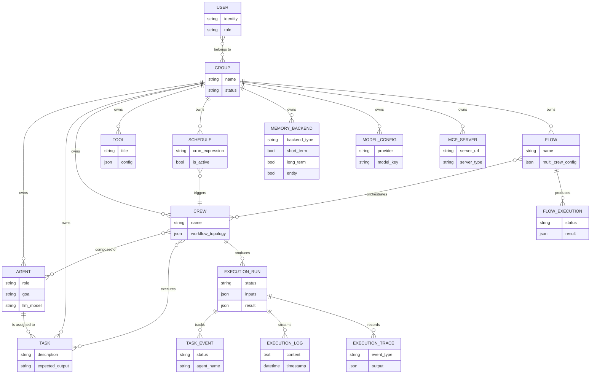
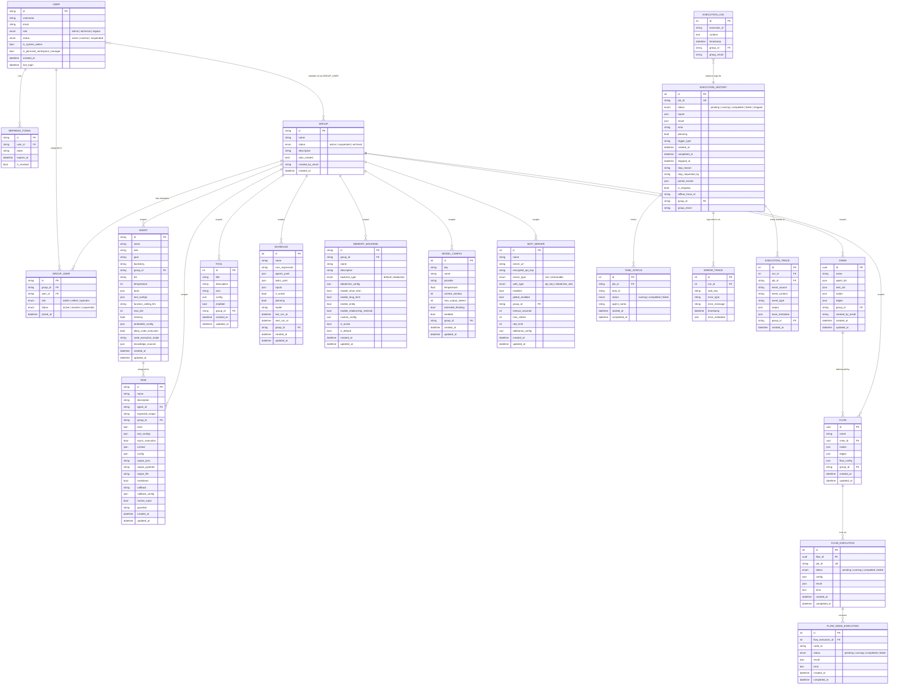

# Kasal Data Models

This document describes the Kasal data model at three levels of abstraction:

- **Conceptual** — business concepts and how they relate, without technical detail
- **Logical** — entities with key attributes and typed relationships, technology-agnostic
- **Physical** — actual database tables, column types, primary keys, and foreign keys

---

## 1. Conceptual Data Model

Focuses on the core business domain. Shows *what* the system tracks, not *how*.



---

## 2. Logical Data Model

Adds key attributes, data types, and relationship cardinalities. Foreign keys are shown as logical references, not necessarily enforced constraints.



---

## 3. Physical Data Model

Exact table names, column names, SQL types, primary keys (PK), unique keys (UK), foreign keys (FK), and notable indexes as defined in the SQLAlchemy models.

```mermaid
erDiagram
    users {
        VARCHAR id PK
        VARCHAR username UK
        VARCHAR email UK
        VARCHAR role
        VARCHAR status
        BOOLEAN is_system_admin
        BOOLEAN is_personal_workspace_manager
        TIMESTAMPTZ created_at
        TIMESTAMPTZ updated_at
        TIMESTAMPTZ last_login
    }
    refresh_tokens {
        VARCHAR id PK
        VARCHAR user_id FK
        VARCHAR token UK
        TIMESTAMPTZ expires_at
        BOOLEAN is_revoked
        TIMESTAMPTZ created_at
    }
    groups {
        VARCHAR(100) id PK
        VARCHAR(255) name
        VARCHAR(50) status
        VARCHAR(500) description
        BOOLEAN auto_created
        VARCHAR(255) created_by_email
        TIMESTAMPTZ created_at
        TIMESTAMPTZ updated_at
    }
    group_users {
        VARCHAR(100) id PK
        VARCHAR(100) group_id FK
        VARCHAR(255) user_id FK
        VARCHAR(50) role
        VARCHAR(50) status
        TIMESTAMPTZ joined_at
        BOOLEAN auto_created
        TIMESTAMPTZ created_at
        TIMESTAMPTZ updated_at
    }
    agents {
        VARCHAR id PK
        VARCHAR name
        VARCHAR role
        VARCHAR goal
        VARCHAR backstory
        VARCHAR(100) group_id IDX
        VARCHAR(255) created_by_email
        VARCHAR llm
        INTEGER temperature
        JSON tools
        JSON tool_configs
        VARCHAR function_calling_llm
        INTEGER max_iter
        INTEGER max_rpm
        INTEGER max_execution_time
        BOOLEAN verbose
        BOOLEAN allow_delegation
        BOOLEAN cache
        BOOLEAN memory
        JSON embedder_config
        VARCHAR system_template
        VARCHAR prompt_template
        VARCHAR response_template
        BOOLEAN allow_code_execution
        VARCHAR code_execution_mode
        INTEGER max_retry_limit
        BOOLEAN use_system_prompt
        BOOLEAN respect_context_window
        JSON knowledge_sources
        DATETIME created_at
        DATETIME updated_at
    }
    tasks {
        VARCHAR id PK
        VARCHAR name
        VARCHAR description
        VARCHAR agent_id FK
        VARCHAR expected_output
        JSON tools
        JSON tool_configs
        BOOLEAN async_execution
        JSON context
        JSON config
        VARCHAR(100) group_id IDX
        VARCHAR(255) created_by_email
        VARCHAR output_json
        VARCHAR output_pydantic
        VARCHAR output_file
        JSON output
        BOOLEAN markdown
        VARCHAR callback
        JSON callback_config
        BOOLEAN human_input
        VARCHAR converter_cls
        VARCHAR guardrail
        DATETIME created_at
        DATETIME updated_at
    }
    crews {
        UUID id PK
        VARCHAR name IDX
        JSON agent_ids
        JSON task_ids
        JSON nodes
        JSON edges
        VARCHAR(100) group_id IDX
        VARCHAR(255) created_by_email
        DATETIME created_at
        DATETIME updated_at
    }
    flows {
        UUID id PK
        VARCHAR name
        UUID crew_id FK
        JSON nodes
        JSON edges
        JSON flow_config
        VARCHAR(100) group_id IDX
        VARCHAR(255) created_by_email
        DATETIME created_at
        DATETIME updated_at
    }
    tools {
        INTEGER id PK
        VARCHAR title
        VARCHAR description
        VARCHAR icon
        JSON config
        BOOLEAN enabled
        VARCHAR(100) group_id IDX
        VARCHAR(255) created_by_email
        DATETIME created_at
        DATETIME updated_at
    }
    schedules {
        INTEGER id PK
        VARCHAR name
        VARCHAR cron_expression
        JSON agents_yaml
        JSON tasks_yaml
        JSON inputs
        BOOLEAN is_active
        BOOLEAN planning
        VARCHAR model
        DATETIME last_run_at
        DATETIME next_run_at
        VARCHAR(100) group_id IDX
        VARCHAR(255) created_by_email
        DATETIME created_at
        DATETIME updated_at
    }
    memory_backends {
        VARCHAR id PK
        VARCHAR(100) group_id IDX
        VARCHAR(255) name
        VARCHAR(1000) description
        VARCHAR backend_type
        JSON databricks_config
        BOOLEAN enable_short_term
        BOOLEAN enable_long_term
        BOOLEAN enable_entity
        BOOLEAN enable_relationship_retrieval
        JSON custom_config
        BOOLEAN is_active
        BOOLEAN is_default
        DATETIME created_at
        DATETIME updated_at
    }
    model_configs {
        INTEGER id PK
        VARCHAR key
        VARCHAR name
        VARCHAR provider
        FLOAT temperature
        INTEGER context_window
        INTEGER max_output_tokens
        BOOLEAN extended_thinking
        BOOLEAN enabled
        VARCHAR(100) group_id IDX
        VARCHAR(255) created_by_email
        DATETIME created_at
        DATETIME updated_at
    }
    mcp_servers {
        INTEGER id PK
        VARCHAR name
        VARCHAR server_url
        VARCHAR encrypted_api_key
        VARCHAR server_type
        VARCHAR auth_type
        BOOLEAN enabled
        BOOLEAN global_enabled
        VARCHAR group_id IDX
        INTEGER timeout_seconds
        INTEGER max_retries
        BOOLEAN model_mapping_enabled
        INTEGER rate_limit
        JSON additional_config
        DATETIME created_at
        DATETIME updated_at
    }
    executionhistory {
        INTEGER id PK
        VARCHAR job_id UK IDX
        VARCHAR status
        JSON inputs
        JSON result
        VARCHAR error
        BOOLEAN planning
        VARCHAR trigger_type
        DATETIME created_at
        DATETIME completed_at
        VARCHAR run_name
        DATETIME stopped_at
        VARCHAR stop_reason
        VARCHAR(255) stop_requested_by
        JSON partial_results
        BOOLEAN is_stopping
        VARCHAR mlflow_trace_id IDX
        VARCHAR mlflow_experiment_name
        VARCHAR mlflow_evaluation_run_id IDX
        VARCHAR(100) group_id IDX
        VARCHAR(255) group_email IDX
    }
    taskstatus {
        INTEGER id PK
        VARCHAR job_id FK IDX
        VARCHAR task_id IDX
        VARCHAR status
        VARCHAR agent_name
        DATETIME started_at
        DATETIME completed_at
    }
    errortrace {
        INTEGER id PK
        INTEGER run_id FK IDX
        VARCHAR task_key IDX
        VARCHAR error_type
        VARCHAR error_message
        TIMESTAMPTZ timestamp
        JSON error_metadata
    }
    execution_trace {
        INTEGER id PK
        INTEGER run_id FK
        VARCHAR job_id FK IDX
        VARCHAR event_source
        VARCHAR event_context
        VARCHAR event_type IDX
        JSON output
        JSON trace_metadata
        VARCHAR(100) group_id IDX
        VARCHAR(255) group_email IDX
        DATETIME created_at
    }
    execution_logs {
        INTEGER id PK
        VARCHAR execution_id IDX
        TEXT content
        DATETIME timestamp
        VARCHAR(100) group_id IDX
        VARCHAR(255) group_email IDX
    }
    flow_executions {
        INTEGER id PK
        UUID flow_id FK
        VARCHAR job_id UK
        VARCHAR status
        JSON config
        JSON result
        TEXT error
        DATETIME created_at
        DATETIME updated_at
        DATETIME completed_at
    }
    flow_node_executions {
        INTEGER id PK
        INTEGER flow_execution_id FK
        VARCHAR node_id
        VARCHAR status
        INTEGER agent_id
        INTEGER task_id
        JSON result
        TEXT error
        DATETIME created_at
        DATETIME updated_at
        DATETIME completed_at
    }

    users ||--o{ refresh_tokens : "user_id → id"
    users ||--o{ group_users : "user_id → id"
    groups ||--o{ group_users : "group_id → id"

    tasks }o--o| agents : "agent_id → id"
    flows }o--o| crews : "crew_id → id"

    executionhistory ||--o{ taskstatus : "job_id → job_id"
    executionhistory ||--o{ errortrace : "id → run_id"
    executionhistory ||--o{ execution_trace : "id → run_id"
    executionhistory ||--o{ execution_trace : "job_id → job_id"

    flow_executions }o--|| flows : "flow_id → id"
    flow_executions ||--o{ flow_node_executions : "id → flow_execution_id"
```

---

## Domain Groupings

The physical tables fall into five logical domains:

### Identity & Access
| Table | Purpose |
|-------|---------|
| `users` | Platform user accounts |
| `refresh_tokens` | JWT refresh token store |
| `groups` | Workspace/tenant groupings |
| `group_users` | User ↔ Group membership with RBAC role |

### Workflow Definition
| Table | Purpose |
|-------|---------|
| `agents` | AI agent definitions (role, goal, LLM, tools) |
| `tasks` | Task definitions (description, expected output, tools) |
| `crews` | Agent+task compositions with visual topology (nodes/edges) |
| `flows` | Multi-crew orchestration graphs |

### Execution & Observability
| Table | Purpose |
|-------|---------|
| `executionhistory` | Lifecycle record for each crew run |
| `taskstatus` | Per-task status within a run |
| `errortrace` | Structured error capture per run |
| `execution_trace` | Granular event trace (agent thoughts, tool calls, outputs) |
| `execution_logs` | Raw text log stream per execution |
| `flow_executions` | Flow-level execution record |
| `flow_node_executions` | Per-node execution tracking within a flow |

### Configuration
| Table | Purpose |
|-------|---------|
| `tools` | Custom tool registry |
| `schedules` | Cron-based execution schedules |
| `memory_backends` | Vector memory backend configuration |
| `model_configs` | LLM model definitions (provider, limits, settings) |
| `mcp_servers` | MCP tool server connections |

### Key Design Notes

- **Group isolation**: Every domain entity has a `group_id` column. All queries are scoped to the current group extracted from the request context.
- **JSON arrays for crew composition**: `crews.agent_ids` and `crews.task_ids` are JSON arrays, not foreign-key join tables. This enables flexible ordering without a junction table.
- **Dual foreign keys in execution_trace**: References `executionhistory` by both `id` (integer PK) and `job_id` (string UUID) to support different lookup patterns.
- **No hardcoded cascade deletes** on most entities — deletion is handled at the service layer to allow soft deletes and audit logging.
- **UUIDs vs integers**: Workflow entities (agents, tasks, crews, flows) use UUID primary keys. Operational/log entities (executionhistory, taskstatus, errortrace, etc.) use auto-increment integers for insert performance.
