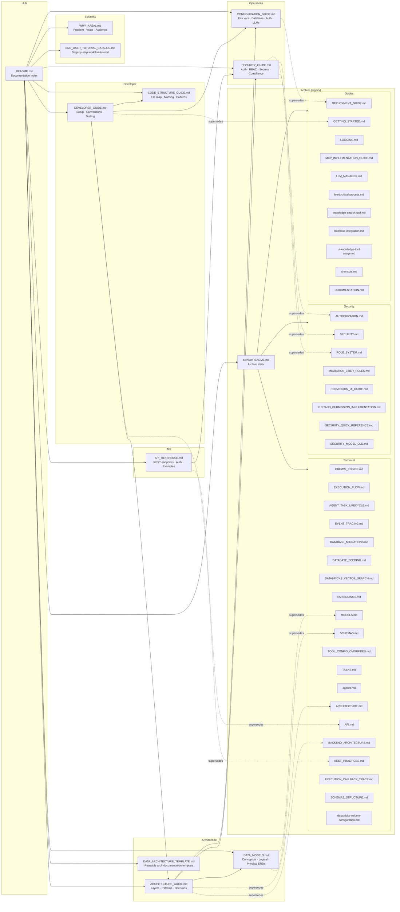

# Kasal Documentation Structure

Conceptual, logical, and physical diagrams of the documentation system — its topics, files, relationships, and folder layout.

---

## 1. Conceptual Documentation Map

Shows the high-level categories of documentation and who they serve. No file names, no folder paths.

```mermaid
graph TD
    KASAL["Kasal Documentation"]

    KASAL --> WHY["Why Kasal\nProblem · Value · Audience"]
    KASAL --> USER["User Guides\nEnd-to-end tutorials"]
    KASAL --> DEV["Developer Docs\nSetup · Code · Testing"]
    KASAL --> ARCH["Architecture Docs\nDesign · Patterns · Models"]
    KASAL --> OPS["Operations Docs\nConfig · Security · Deploy"]
    KASAL --> API["API Reference\nEndpoints · Auth · Examples"]
    KASAL --> ARCHIVE["Archive\nLegacy deep-dives"]

    DEV --> DEV1["Getting Started"]
    DEV --> DEV2["Code Structure"]
    DEV --> DEV3["Development Workflow"]

    ARCH --> ARCH1["System Architecture"]
    ARCH --> ARCH2["Data Models"]
    ARCH --> ARCH3["Data Architecture Template"]

    OPS --> OPS1["Configuration"]
    OPS --> OPS2["Security & Access Control"]

    ARCHIVE --> ARC_T["Technical Deep-Dives"]
    ARCHIVE --> ARC_S["Security Legacy"]
    ARCHIVE --> ARC_G["Operational Guides"]

    style KASAL fill:#1565C0,color:#fff
    style WHY fill:#6A1B9A,color:#fff
    style USER fill:#2E7D32,color:#fff
    style DEV fill:#E65100,color:#fff
    style ARCH fill:#AD1457,color:#fff
    style OPS fill:#00695C,color:#fff
    style API fill:#0277BD,color:#fff
    style ARCHIVE fill:#546E7A,color:#fff
```

---

## 2. Logical Documentation Map

Shows the actual documents, their audience, and how they reference each other. Grouped by purpose.

---

## 3. Physical Documentation Structure

Exact file paths, grouped by directory, with metadata.

```mermaid
graph TD
    ROOT["src/docs/"]

    ROOT --> README_F["README.md\n📋 Index hub · All audiences"]
    ROOT --> WHY_F["WHY_KASAL.md\n💡 Value proposition · Stakeholders"]
    ROOT --> TUTORIAL_F["END_USER_TUTORIAL_CATALOG.md\n🧑‍💻 Tutorial · End users"]
    ROOT --> DEV_F["DEVELOPER_GUIDE.md\n⚙️ Dev setup · Engineers"]
    ROOT --> CODE_F["CODE_STRUCTURE_GUIDE.md\n🗂️ File map · Engineers"]
    ROOT --> ARCH_F["ARCHITECTURE_GUIDE.md\n🏛️ System design · Architects"]
    ROOT --> DATA_M_F["DATA_MODELS.md\n📐 ER diagrams · DBAs · Devs"]
    ROOT --> DATA_T_F["DATA_ARCHITECTURE_TEMPLATE.md\n📄 Arch template · Architects"]
    ROOT --> CONFIG_F["CONFIGURATION_GUIDE.md\n🔧 Env vars · DevOps"]
    ROOT --> SEC_F["SECURITY_GUIDE.md\n🔒 Auth · RBAC · Admins"]
    ROOT --> API_F["API_REFERENCE.md\n🔌 REST API · Integrators"]

    ROOT --> ARCHIVE_DIR["archive/"]

    ARCHIVE_DIR --> ARC_README_F["README.md\n📋 Archive index"]

    ARCHIVE_DIR --> TECH_DIR["technical/\n20 files"]
    TECH_DIR --> T1["ARCHITECTURE.md"]
    TECH_DIR --> T2["API.md"]
    TECH_DIR --> T3["BACKEND_ARCHITECTURE.md"]
    TECH_DIR --> T4["BEST_PRACTICES.md"]
    TECH_DIR --> T5["CREWAI_ENGINE.md"]
    TECH_DIR --> T6["EXECUTION_FLOW.md"]
    TECH_DIR --> T7["EXECUTION_CALLBACK_TRACE.md"]
    TECH_DIR --> T8["EVENT_TRACING.md"]
    TECH_DIR --> T9["AGENT_TASK_LIFECYCLE.md"]
    TECH_DIR --> T10["agents.md"]
    TECH_DIR --> T11["TASKS.md"]
    TECH_DIR --> T12["TOOL_CONFIG_OVERRIDES.md"]
    TECH_DIR --> T13["MODELS.md"]
    TECH_DIR --> T14["SCHEMAS.md"]
    TECH_DIR --> T15["SCHEMAS_STRUCTURE.md"]
    TECH_DIR --> T16["DATABASE_MIGRATIONS.md"]
    TECH_DIR --> T17["DATABASE_SEEDING.md"]
    TECH_DIR --> T18["DATABRICKS_VECTOR_SEARCH.md"]
    TECH_DIR --> T19["EMBEDDINGS.md"]
    TECH_DIR --> T20["databricks-volume-configuration.md"]

    ARCHIVE_DIR --> SEC_DIR["security/\n8 files"]
    SEC_DIR --> S1["AUTHORIZATION.md"]
    SEC_DIR --> S2["SECURITY.md"]
    SEC_DIR --> S3["SECURITY_MODEL_OLD.md"]
    SEC_DIR --> S4["SECURITY_QUICK_REFERENCE.md"]
    SEC_DIR --> S5["ROLE_SYSTEM.md"]
    SEC_DIR --> S6["MIGRATION_3TIER_ROLES.md"]
    SEC_DIR --> S7["PERMISSION_UI_GUIDE.md"]
    SEC_DIR --> S8["ZUSTAND_PERMISSION_IMPLEMENTATION.md"]

    ARCHIVE_DIR --> GUIDE_DIR["guides/\n11 files"]
    GUIDE_DIR --> G1["GETTING_STARTED.md"]
    GUIDE_DIR --> G2["DEPLOYMENT_GUIDE.md"]
    GUIDE_DIR --> G3["LOGGING.md"]
    GUIDE_DIR --> G4["LLM_MANAGER.md"]
    GUIDE_DIR --> G5["MCP_IMPLEMENTATION_GUIDE.md"]
    GUIDE_DIR --> G6["hierarchical-process.md"]
    GUIDE_DIR --> G7["knowledge-search-tool.md"]
    GUIDE_DIR --> G8["lakebase-integration.md"]
    GUIDE_DIR --> G9["ui-knowledge-tool-usage.md"]
    GUIDE_DIR --> G10["shortcuts.md"]
    GUIDE_DIR --> G11["DOCUMENTATION.md"]

    style ROOT fill:#1565C0,color:#fff
    style ARCHIVE_DIR fill:#546E7A,color:#fff
    style TECH_DIR fill:#37474F,color:#fff
    style SEC_DIR fill:#37474F,color:#fff
    style GUIDE_DIR fill:#37474F,color:#fff
```

---

## File Inventory

### Active Documentation (11 files)

| File | Status | Primary Audience | Topic |
|------|--------|-----------------|-------|
| [README.md](./README.md) | Active | All | Documentation hub and index |
| [WHY_KASAL.md](./WHY_KASAL.md) | Active | Stakeholders, Business | Problem statement, value proposition |
| [END_USER_TUTORIAL_CATALOG.md](./END_USER_TUTORIAL_CATALOG.md) | Active | End Users | Step-by-step workflow building tutorial |
| [DEVELOPER_GUIDE.md](./DEVELOPER_GUIDE.md) | Active | Engineers | Local setup, conventions, testing |
| [CODE_STRUCTURE_GUIDE.md](./CODE_STRUCTURE_GUIDE.md) | Active | Engineers | File map, module responsibilities |
| [ARCHITECTURE_GUIDE.md](./ARCHITECTURE_GUIDE.md) | Active | Architects, Tech Leads | System design, layers, patterns |
| [DATA_MODELS.md](./DATA_MODELS.md) | Active | Architects, DBAs, Devs | Conceptual, logical, physical ER diagrams |
| [DATA_ARCHITECTURE_TEMPLATE.md](./DATA_ARCHITECTURE_TEMPLATE.md) | Active | Architects, DBAs | Reusable data architecture template |
| [CONFIGURATION_GUIDE.md](./CONFIGURATION_GUIDE.md) | Active | DevOps, Developers | Environment variables, database, auth |
| [SECURITY_GUIDE.md](./SECURITY_GUIDE.md) | Active | Security Engineers, Admins | Auth, RBAC, secrets, compliance |
| [API_REFERENCE.md](./API_REFERENCE.md) | Active | API Integrators | REST endpoints, auth, examples |

### Archived Documentation (39 files)

#### Technical Deep-Dives (`archive/technical/`)

| File | Superseded By |
|------|--------------|
| ARCHITECTURE.md | ARCHITECTURE_GUIDE.md |
| BACKEND_ARCHITECTURE.md | ARCHITECTURE_GUIDE.md |
| API.md | API_REFERENCE.md |
| BEST_PRACTICES.md | DEVELOPER_GUIDE.md |
| MODELS.md | DATA_MODELS.md |
| SCHEMAS.md | DATA_MODELS.md |
| SCHEMAS_STRUCTURE.md | DATA_MODELS.md |
| CREWAI_ENGINE.md | ARCHITECTURE_GUIDE.md |
| EXECUTION_FLOW.md | ARCHITECTURE_GUIDE.md |
| EXECUTION_CALLBACK_TRACE.md | — (detail not covered in active docs) |
| EVENT_TRACING.md | — (detail not covered in active docs) |
| AGENT_TASK_LIFECYCLE.md | CODE_STRUCTURE_GUIDE.md |
| agents.md | CODE_STRUCTURE_GUIDE.md |
| TASKS.md | CODE_STRUCTURE_GUIDE.md |
| TOOL_CONFIG_OVERRIDES.md | — (detail not covered in active docs) |
| DATABASE_MIGRATIONS.md | DEVELOPER_GUIDE.md |
| DATABASE_SEEDING.md | DEVELOPER_GUIDE.md |
| DATABRICKS_VECTOR_SEARCH.md | CONFIGURATION_GUIDE.md |
| EMBEDDINGS.md | CONFIGURATION_GUIDE.md |
| databricks-volume-configuration.md | CONFIGURATION_GUIDE.md |

#### Security Legacy (`archive/security/`)

| File | Superseded By |
|------|--------------|
| SECURITY.md | SECURITY_GUIDE.md |
| SECURITY_MODEL_OLD.md | SECURITY_GUIDE.md |
| AUTHORIZATION.md | SECURITY_GUIDE.md |
| ROLE_SYSTEM.md | SECURITY_GUIDE.md |
| SECURITY_QUICK_REFERENCE.md | SECURITY_GUIDE.md |
| MIGRATION_3TIER_ROLES.md | — (migration complete) |
| PERMISSION_UI_GUIDE.md | SECURITY_GUIDE.md |
| ZUSTAND_PERMISSION_IMPLEMENTATION.md | — (implementation detail) |

#### Operational Guides (`archive/guides/`)

| File | Superseded By |
|------|--------------|
| GETTING_STARTED.md | DEVELOPER_GUIDE.md |
| DEPLOYMENT_GUIDE.md | CONFIGURATION_GUIDE.md |
| LOGGING.md | CONFIGURATION_GUIDE.md |
| LLM_MANAGER.md | CONFIGURATION_GUIDE.md |
| MCP_IMPLEMENTATION_GUIDE.md | ARCHITECTURE_GUIDE.md |
| hierarchical-process.md | ARCHITECTURE_GUIDE.md |
| knowledge-search-tool.md | ARCHITECTURE_GUIDE.md |
| lakebase-integration.md | CONFIGURATION_GUIDE.md |
| ui-knowledge-tool-usage.md | END_USER_TUTORIAL_CATALOG.md |
| shortcuts.md | — (detail not covered in active docs) |
| DOCUMENTATION.md | README.md |

---

## Coverage Map

Which active document covers each major topic area:

| Topic | Primary Doc | Secondary Doc |
|-------|------------|--------------|
| Project purpose and value | WHY_KASAL.md | README.md |
| Local development setup | DEVELOPER_GUIDE.md | — |
| Adding a new feature end-to-end | DEVELOPER_GUIDE.md | CODE_STRUCTURE_GUIDE.md |
| Where to find a file | CODE_STRUCTURE_GUIDE.md | — |
| System architecture layers | ARCHITECTURE_GUIDE.md | — |
| Crew execution pipeline | ARCHITECTURE_GUIDE.md | — |
| Database schema / ER diagrams | DATA_MODELS.md | — |
| Multi-tenancy design | ARCHITECTURE_GUIDE.md | SECURITY_GUIDE.md |
| Environment variables | CONFIGURATION_GUIDE.md | — |
| Databricks Apps deployment | CONFIGURATION_GUIDE.md | SECURITY_GUIDE.md |
| JWT authentication flow | SECURITY_GUIDE.md | API_REFERENCE.md |
| Role-based access control | SECURITY_GUIDE.md | — |
| REST API endpoints | API_REFERENCE.md | — |
| Building a workflow (UI) | END_USER_TUTORIAL_CATALOG.md | — |
| Writing tests | DEVELOPER_GUIDE.md | — |
| Database migrations | DEVELOPER_GUIDE.md | — |
